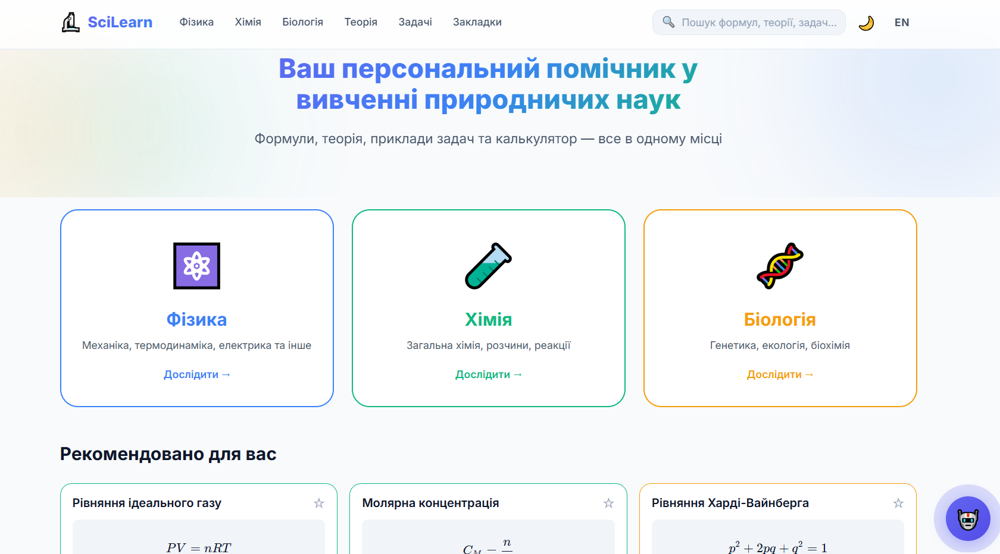

# 🔬 SciLearn — Інформаційно-обчислювальний застосунок для студентів природничих спеціальностей

> Веборієнтована освітня платформа для студентів природничих спеціальностей, яка поєднує інтерактивну базу формул, автоматизовані обчислення, персоналізовані рекомендації та AI-асистента на основі механізму Graph/Keyword RAG.

---

# 👤 Автор

- **ПІБ:** Фіняк Олег Володимирович
- **Група:** ФЕП-41с
- **Спеціальність:** 121 – Інженерія програмного забезпечення
- **Факультет:** Електроніки та комп'ютерних технологій
- **Навчальний заклад:** Львівський національний університет імені Івана Франка
- **Керівник:** Гура Володимир Тарасович, кандидат технічних наук, асистент кафедри радіоелектронних і комп’ютерних систем
- **Тип роботи:** Кваліфікаційна (бакалаврська) робота
- **Рік:** 2026

---

# 📌 Загальна інформація

**SciLearn** — це сучасна SPA-платформа, розроблена для підтримки навчального процесу студентів фізичних, хімічних та біологічних спеціальностей.

Основною метою проєкту є усунення фрагментації навчальних матеріалів шляхом інтеграції теоретичного контенту, інтерактивних формул, автоматизованих обчислень, рекомендаційної системи та штучного інтелекту в єдиному вебсередовищі.

---

# 🛠 Технологічний стек

| Категорія          | Технології                   |
| ------------------ | ---------------------------- |
| Frontend           | React 19                     |
| Мова програмування | TypeScript 5.9               |
| Збірка проєкту     | Vite 6                       |
| Маршрутизація      | React Router DOM             |
| База даних         | Firebase Firestore           |
| Авторизація        | Firebase Authentication      |
| Пошук              | Fuse.js                      |
| Рендеринг формул   | KaTeX                        |
| Локалізація        | i18next                      |
| Штучний інтелект   | Google Gemini 3.1 Flash-Lite |
| Тестування         | Vitest                       |
| Розгортання        | Firebase Hosting             |

---

# 🧠 Основний функціонал

## 📐 Інтерактивна база формул

Платформа містить структуровану базу наукових формул:

- Фізика — 30 формул
- Хімія — 25 формул
- Біологія — 23 формули

Для кожної формули доступні:

- математичний запис у форматі LaTeX;
- опис змінних;
- одиниці вимірювання;
- автоматичний калькулятор;
- пов'язані формули та теми.

---

## 📖 Теоретичні матеріали

Система містить:

- тематичні статті;
- пояснення понять;
- структуровані навчальні матеріали;
- поділ за рівнем складності.

---

## 🧮 Обчислювальний модуль

Функціональність:

- автоматичне обчислення параметрів формул;
- перевірка коректності введених значень;
- миттєве оновлення результатів;
- підтримка наукових розрахунків без сторонніх калькуляторів.

---

## 🤖 AI-асистент

Інтелектуальний помічник працює на основі:

- Google Gemini 3.1 Flash-Lite;
- локального механізму Graph/Keyword RAG;
- графа знань, сформованого з навчальних матеріалів.

Можливості:

- відповіді на питання користувачів;
- пошук формул;
- пояснення теоретичних понять;
- навігація по платформі;
- офлайн-відповіді без доступу до Gemini API.

---

## 📊 Персоналізовані рекомендації

Реалізовано систему рекомендацій на основі:

- Collaborative Filtering;
- Cosine Similarity.

Враховуються:

- перегляди матеріалів;
- використання формул;
- обрані закладки;
- історія взаємодії користувача.

---

## 🔍 Інтелектуальний пошук

Система пошуку використовує Fuse.js та підтримує:

- нечіткий пошук;
- пошук по формулах;
- пошук по теоретичних матеріалах;
- пошук по задачах;
- швидку навігацію по результатах.

---

## 🌐 Локалізація

Платформа підтримує:

- 🇺🇦 Українську мову
- 🇬🇧 Англійську мову

---

## ⭐ Закладки

Користувач може:

- зберігати обрані формули;
- створювати власну добірку матеріалів;
- синхронізувати дані між пристроями через Firebase.

---

# 🏗 Архітектура проєкту

Проєкт реалізовано відповідно до методології **Feature-Sliced Design (FSD)**.

Основні шари:

```text
src/
│
├── app/
├── features/
├── shared/
```

### app

Містить:

- маршрутизацію;
- глобальні провайдери;
- головну конфігурацію застосунку.

### features

Містить бізнес-логіку:

- formulas
- calculator
- assistant
- recommendations
- theory
- problems
- bookmarks
- search

### shared

Містить спільні компоненти:

- типи даних;
- утиліти;
- UI-компоненти;
- Firebase-конфігурацію;
- локалізацію.

---

# 📂 Основні модулі системи

| Модуль          | Призначення              |
| --------------- | ------------------------ |
| formulas        | База формул та навігація |
| calculator      | Виконання розрахунків    |
| assistant       | AI-асистент              |
| recommendations | Рекомендаційна система   |
| search          | Інтелектуальний пошук    |
| theory          | Теоретичні матеріали     |
| problems        | Практичні задачі         |
| bookmarks       | Закладки користувача     |
| auth            | Авторизація              |
| firebase        | Взаємодія з Firestore    |

---

# ▶️ Запуск проєкту

## 1. Встановлення залежностей

```bash
npm install
```

---

## 2. Створення файлу .env

```env
VITE_FIREBASE_API_KEY=
VITE_FIREBASE_AUTH_DOMAIN=
VITE_FIREBASE_PROJECT_ID=
VITE_FIREBASE_STORAGE_BUCKET=
VITE_FIREBASE_MESSAGING_SENDER_ID=
VITE_FIREBASE_APP_ID=

VITE_GEMINI_API_KEY=
```

---

## 3. Запуск у режимі розробки

```bash
npm run dev
```

---

## 4. Перевірка типів

```bash
npm run typecheck
```

---

## 5. Запуск тестів

```bash
npm test
```

---

## 6. Збірка проєкту

```bash
npm run build
```

---

# 🖱 Інструкція користувача

## Головна сторінка

Користувач отримує:

- список предметів;
- рекомендований контент;
- швидкий доступ до пошуку;
- доступ до AI-асистента.

---

## Розділ формул

Дозволяє:

- переглядати формули;
- виконувати розрахунки;
- переглядати пояснення змінних;
- переходити до пов'язаних матеріалів.

---

## Теоретичний розділ

Надає:

- структуровані статті;
- пояснення понять;
- навчальні матеріали за темами.

---

## Розділ задач

Містить:

- приклади розв'язків;
- покрокові пояснення;
- навчальні кейси.

---

## AI-асистент

Користувач може:

- ставити питання природничого спрямування;
- отримувати пояснення формул;
- шукати потрібні матеріали;
- отримувати навігаційні підказки.

---

# 🧪 Тестування

У проєкті реалізовано:

- модульне тестування;
- characterization testing;
- перевірку алгоритмів рекомендацій;
- тестування AI-модуля;
- тестування пошукового механізму;
- тестування обчислювального ядра.

Загальна кількість тестів: **148+**

---

# 🚀 Розгортання

Платформа розгортається через Firebase Hosting.

Команда для деплою:

```bash
firebase deploy
```

---

# 📈 Переваги системи

- Єдина освітня платформа для природничих дисциплін
- Автоматизація обчислень
- Інтегрований AI-асистент
- Персоналізовані рекомендації
- Підтримка офлайн-роботи
- Висока швидкодія SPA
- Адаптивний дизайн
- Двомовний інтерфейс

---

# 📚 Використані джерела

1. React Documentation
2. TypeScript Documentation
3. Firebase Documentation
4. Feature-Sliced Design Documentation
5. Google Gemini API Documentation
6. KaTeX Documentation
7. Fuse.js Documentation
8. Vitest Documentation
9. i18next Documentation

---

# 📷 Скріншоти

## Головна сторінка



## Сторінка формули

_Додати скріншот_

## AI-асистент

_Додати скріншот_

## Рекомендації

_Додати скріншот_

## Пошук

_Додати скріншот_

---

# 📄 Ліцензія

Проєкт створено в рамках виконання бакалаврської кваліфікаційної роботи спеціальності **121 – Інженерія програмного забезпечення** Львівського національного університету імені Івана Франка.
