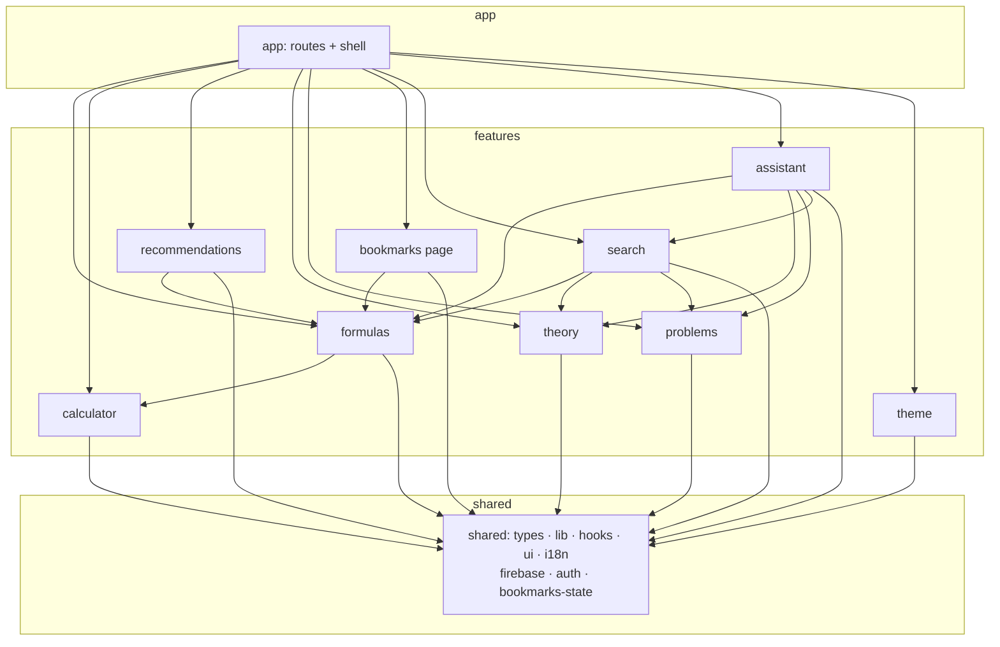

# Architecture

This document describes the software architecture of **SciLearn**, the
recommendation system for natural-science students. It is written for both
maintainers and the thesis committee: it states the architectural style, the
layering rules, the rationale behind the non-obvious decisions, and how the
rules are kept honest.

---

## 1. Architectural style

The frontend follows a **feature-sliced, layered modular architecture**
(a pragmatic variant of *Feature-Sliced Design* / *vertical slice
architecture*).

The codebase is partitioned into **three layers**, each a directory under
`src/`:

| Layer        | Directory      | Responsibility                                                                 |
|--------------|----------------|--------------------------------------------------------------------------------|
| Composition  | `src/app/`     | The composition root: wires features into routes and provider trees; owns the application shell (Layout, Header) and global styles. |
| Features     | `src/features/`| Vertical slices — one folder per user-facing capability. Each owns its data, logic, UI, pages and tests behind a public API. |
| Shared       | `src/shared/`  | Horizontal foundation — domain-agnostic primitives and genuinely cross-cutting application state. |

The guiding principle is **high cohesion, low coupling**: everything that
changes together for one capability lives together in one feature folder,
and what is shared is shared deliberately, not by accident.

---

## 2. The dependency rule

Dependencies point **downward only**:

```
app  ──▶  features  ──▶  shared
                 │            ▲
                 └────────────┘   (a feature may use another feature
                                   through its public barrel — acyclic)
```

Concretely:

- `app/` may import any feature (via its barrel) and anything in `shared/`.
- A `feature/` may import `shared/` and **sibling features through their
  public `index.ts` barrel only** — never another feature's internal files.
- `shared/` may import **only** other `shared/` modules. It never imports
  `app/` or `features/`.

There are **no cyclic dependencies** between features. The dependency graph
is a DAG; `formulas`, `theory` and `problems` act as foundational content
slices that `search`, `recommendations` and `assistant` consume.

---

## 3. The public-API (barrel) convention

Every feature exposes exactly one entry point: `src/features/<name>/index.ts`.

- **Cross-feature and app code import from the barrel:**
  `import { FormulaCard } from '@/features/formulas'`.
- **Intra-feature code uses concrete paths** (the feature's own files are
  private by convention).
- **Tests import the concrete unit under test**, not the barrel — a
  characterization test should pin one module, not a re-export surface.

The convention is *not* enforced by a lint rule (Biome lacks a strong
import-boundary rule); it is upheld by review and by the fact that the
typecheck + test + build gate is run green at every step.

> **Worked example — name disambiguation.** `lib/formulas.ts` exports an
> aggregated `getAllFormulas(): SubjectFormula[]`, while each subject dataset
> (`data/physics.ts` …) also exports a `getAllFormulas(): Formula[]`. The
> `formulas` barrel resolves the clash by re-exporting the per-subject ones
> under explicit aliases (`getAllPhysicsFormulas`, …) while keeping the
> aggregate name canonical. Consumers get one unambiguous public API.

---

## 4. Module map

```
src/
├── app/                         # Composition root
│   ├── App.tsx                  #   route table
│   ├── main.tsx                 #   entry — mounts provider tree (index.html → here)
│   ├── components/
│   │   ├── Layout/              #   shell: header + <Outlet/> + footer + AIAssistant
│   │   └── Header/              #   nav bar (consumes search + theme features)
│   └── styles/                  #   global.css, variables.css (design tokens)
│
├── features/                    # Vertical slices (each has an index.ts barrel)
│   ├── formulas/                #   datasets (phys/chem/bio) + catalog lib +
│   │                            #   FormulaCard + Subject & FormulaDetail pages
│   ├── calculator/              #   pure calc lib + useCalculator + Calculator UI
│   ├── recommendations/         #   collaborative-filtering service + Home page
│   ├── theory/                  #   theory dataset + Theory page
│   ├── problems/                #   problems dataset + Problems page
│   ├── bookmarks/               #   Bookmarks page (state lives in shared/bookmarks)
│   ├── search/                  #   Fuse.js service + SearchBar
│   ├── assistant/               #   AIAssistant UI + chat hooks + RAG engine
│   │                            #   (assistantEngine + services/assistant/*)
│   └── theme/                   #   ThemeContext + persistence service
│
├── shared/                      # Horizontal foundation (shared imports only shared)
│   ├── types/domain.ts          #   the ubiquitous domain model (single source of truth)
│   ├── lib/                     #   pure utils: env, pickLang, katex, navigation (+ tests)
│   ├── hooks/                   #   generic hooks: useLocalized, useClickOutside, …
│   ├── ui/                      #   presentation primitives: Latex, Breadcrumb,
│   │                            #   LoadingSkeleton, FilterBar, ErrorBoundary
│   ├── i18n/                    #   i18next config + en/uk locale bundles
│   ├── firebase/                #   config + firestore data access (infrastructure)
│   ├── auth/                    #   AuthContext (cross-cutting provider)
│   └── bookmarks/               #   BookmarkContext + persistence (cross-cutting state)
│
└── vite-env.d.ts                # ambient Vite/import.meta.env types
```

---

## 5. Feature dependency graph



Every arrow points down or sideways-through-a-barrel; none point back up.

---

## 6. Notable design decisions (and why)

### 6.1 Cross-cutting state is `shared`, not a feature

`FormulaCard` (a `formulas` component) shows a bookmark toggle, so it depends
on the bookmark context. The `Bookmarks` page depends on `FormulaCard`. Naive
slicing would put the bookmark context in a `bookmarks` feature and produce a
`formulas ⇄ bookmarks` **cycle**.

Resolution: a bookmark is **application-wide state mounted as a top-level
provider** — it is genuinely cross-cutting, not a property of either slice.
So `BookmarkContext` + its persistence service live in `shared/bookmarks`.
The `bookmarks` *feature* keeps only the page. The cycle disappears with
**zero behavioural change**.

The same reasoning promoted **`AuthContext` to `shared/auth`**: a *shared*
module (`BookmarkContext`) calls `useAuth`, so auth must sit in `shared` to
keep the "shared imports only shared" rule intact. `ThemeContext` stays a
feature because nothing in `shared` depends on it — the rule is applied by
consequence, not dogma.

### 6.2 The domain model stays a single shared module

`shared/types/domain.ts` is imported by almost every file. Splitting it per
feature would be high-churn, high-risk, and would fragment the *ubiquitous
language* the whole app speaks. It is deliberately kept as one canonical
shared type module.

### 6.3 Path alias and import convention

`@/*` resolves to `src/*` (declared once in `tsconfig.json`, mirrored in
`vite.config.js`, which Vitest also reads). Convention:

- **cross-directory** imports use the alias: `@/shared/lib/katex`,
  `@/features/search`;
- **same-directory siblings and co-located CSS** stay relative: `./types`,
  `./Header.css`.

This keeps moves cheap (rename the target, rewrite specifiers) and makes the
layer of any import obvious from its first path segment.

---

## 7. Testing strategy

129 Vitest characterization tests run in `jsdom`. Tests are **co-located
with the unit they pin**:

- `src/features/<name>/__tests__/…` for feature logic
  (formulas, calculator, recommendations, search, and the assistant pipeline);
- `src/shared/lib/__tests__/…` for shared pure utilities
  (env, katex, navigation, pickLang).

They import the **concrete module**, not the barrel, so a failure points at
a specific unit rather than a re-export surface. The quality gate for any
change is:

```
npm run typecheck && npm test && npm run build && npm run format:check
```

---

## 8. Migration provenance

This structure was reached by an explicit, reviewable migration from the
previous layer-based layout (`components/`, `pages/`, `services/`, …). The
work was executed as **17 sequential commits, one per migration phase**
(`shared/types` → `shared/lib` → `shared/hooks` → `shared/ui` →
`shared/i18n`+`firebase` → `shared/bookmarks` → the eight feature slices →
`shared/auth` → `theme` → the `app/` shell). The full quality gate
(typecheck + 129 tests + production build + formatter) was run **green
before every commit**, so the migration is bisectable and no commit ships a
broken tree.
