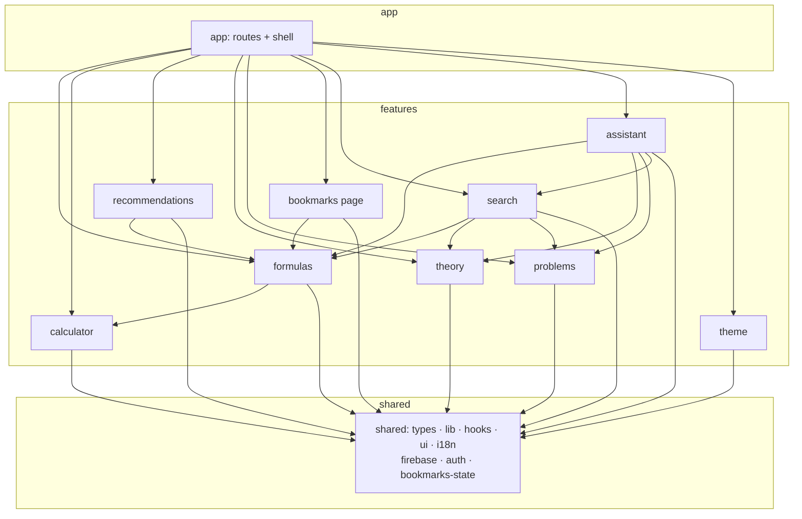

# Architecture

This document describes the software architecture of **SciLearn**, the
recommendation system for natural-science students. It is written for both
maintainers and the thesis committee: it states the architectural style, the
layering rules, the rationale behind the non-obvious decisions, and how the
rules are kept honest.

---

## 1. Architectural style

The frontend follows a **feature-sliced, layered modular architecture**
(a pragmatic variant of *Feature-Sliced Design* / *vertical slice
architecture*).

The codebase is partitioned into **three layers**, each a directory under
`src/`:

| Layer        | Directory      | Responsibility                                                                 |
|--------------|----------------|--------------------------------------------------------------------------------|
| Composition  | `src/app/`     | The composition root: wires features into routes and provider trees; owns the application shell (Layout, Header) and global styles. |
| Features     | `src/features/`| Vertical slices — one folder per user-facing capability. Each owns its data, logic, UI, pages and tests behind a public API. |
| Shared       | `src/shared/`  | Horizontal foundation — domain-agnostic primitives and genuinely cross-cutting application state. |

The guiding principle is **high cohesion, low coupling**: everything that
changes together for one capability lives together in one feature folder,
and what is shared is shared deliberately, not by accident. The operative
rule for *where any module lives* — **location follows its consumers, not
its kind** — is stated in full in [§6.1](#61-the-placement-rule-location-follows-consumers-not-kind),
and is what makes the auth/bookmarks/theme split principled rather than
arbitrary.

---

## 2. The dependency rule

Dependencies point **downward only**:

```
app  ──▶  features  ──▶  shared
                 │            ▲
                 └────────────┘   (a feature may use another feature
                                   through its public barrel — acyclic)
```

Concretely:

- `app/` may import any feature (via its barrel) and anything in `shared/`.
- A `feature/` may import `shared/` and **sibling features through their
  public `index.ts` barrel only** — never another feature's internal files.
- `shared/` may import **only** other `shared/` modules. It never imports
  `app/` or `features/`.

There are **no cyclic dependencies** between features. The dependency graph
is a DAG; `formulas`, `theory` and `problems` act as foundational content
slices that `search`, `recommendations` and `assistant` consume.

---

## 3. The public-API (barrel) convention

Every feature exposes exactly one entry point: `src/features/<name>/index.ts`.

- **Cross-feature and app code import from the barrel:**
  `import { FormulaCard } from '@/features/formulas'`.
- **Intra-feature code uses concrete paths** (the feature's own files are
  private by convention).
- **Tests import the concrete unit under test**, not the barrel — a
  characterization test should pin one module, not a re-export surface.

The convention is *not* enforced by a lint rule (Biome lacks a strong
import-boundary rule); it is upheld by review and by the fact that the
typecheck + test + build gate is run green at every step.

> **Worked example — name disambiguation.** `lib/formulas.ts` exports an
> aggregated `getAllFormulas(): SubjectFormula[]`, while each subject dataset
> (`data/physics.ts` …) also exports a `getAllFormulas(): Formula[]`. The
> `formulas` barrel resolves the clash by re-exporting the per-subject ones
> under explicit aliases (`getAllPhysicsFormulas`, …) while keeping the
> aggregate name canonical. Consumers get one unambiguous public API.

---

## 4. Module map

```
src/
├── app/                         # Composition root
│   ├── App.tsx                  #   route table
│   ├── main.tsx                 #   entry — mounts provider tree (index.html → here)
│   ├── components/
│   │   ├── Layout/              #   shell: header + <Outlet/> + footer + AIAssistant
│   │   └── Header/              #   nav bar (consumes search + theme features)
│   └── styles/                  #   global.css, variables.css (design tokens)
│
├── features/                    # Vertical slices (each has an index.ts barrel)
│   ├── formulas/                #   datasets (phys/chem/bio) + catalog lib +
│   │                            #   FormulaCard + Subject & FormulaDetail pages
│   ├── calculator/              #   pure calc lib + useCalculator + Calculator UI
│   ├── recommendations/         #   collaborative-filtering service + Home page
│   ├── theory/                  #   theory dataset + Theory page
│   ├── problems/                #   problems dataset + Problems page
│   ├── bookmarks/               #   Bookmarks page (state lives in shared/bookmarks)
│   ├── search/                  #   Fuse.js service + SearchBar
│   ├── assistant/               #   AIAssistant UI + chat hooks + RAG engine
│   │                            #   (assistantEngine + services/assistant/*)
│   └── theme/                   #   ThemeContext + persistence service
│
├── shared/                      # Horizontal foundation (shared imports only shared)
│   ├── types/                   #   domain model split per bounded context:
│   │                            #   content · graph · search · recommendations,
│   │                            #   re-exported by a thin domain.ts barrel
│   ├── lib/                     #   pure utils: env, pickLang, katex, navigation,
│   │                            #   subjectColor, subjectIcon, mergeById, … (+ tests)
│   ├── hooks/                   #   generic hooks: useLocalized, useClickOutside, …
│   ├── ui/                      #   presentation primitives: Latex, Breadcrumb,
│   │                            #   LoadingSkeleton, FilterBar, Markdown, ErrorBoundary
│   ├── i18n/                    #   i18next config + en/uk locale bundles
│   ├── firebase/                #   config + firestore data access (infrastructure)
│   ├── auth/                    #   AuthContext + useFirebaseAuthState hook
│   └── bookmarks/               #   BookmarkContext + typed local/remote stores
│
└── vite-env.d.ts                # ambient Vite/import.meta.env types
```

---

## 5. Feature dependency graph



Every arrow points down or sideways-through-a-barrel; none point back up.

---

## 6. Notable design decisions (and why)

### 6.1 The placement rule: location follows *consumers*, not *kind*

The single most important principle in this codebase:

> **A module's home is decided by who consumes it — not by what kind of
> thing it is.** "It's a React context / a provider / a hook" is *not* a
> reason to put something in `shared/`. The test is the consumer set.

Concretely, a stateful provider goes in `shared/` **only if** a `shared/`
module depends on it **or** two or more features depend on it. Otherwise it
stays inside the one feature that owns it (or, if only `app/` consumes it,
it can remain a feature — `app/` is allowed to import features).

The three top-level providers (auth, bookmarks, theme) are *the same kind of
thing* (a React context mounted in `main.tsx`) yet land in **different
layers**, purely because their consumer sets differ. This is the rule
applied **by consequence, not by dogma**:

| Provider | Actual consumers (verified) | Decision | Why |
|---|---|---|---|
| **bookmarks** (`useBookmarks`) | `features/formulas` (`FormulaCard`, `FormulaDetail`), `features/bookmarks` (page), `app/main.tsx` | → `shared/bookmarks` | Consumed by **two features**. Leaving it in `features/bookmarks` creates a cycle: `FormulaCard` (formulas) needs it, while the Bookmarks page needs `FormulaCard` ⇒ `formulas ⇄ bookmarks`. |
| **auth** (`useAuth`) | `shared/bookmarks` (!), `features/formulas` (`FormulaDetail`), `features/recommendations` (`Home`), `app/main.tsx` | → `shared/auth` | **Forced.** A *shared* module (`BookmarkContext`) calls `useAuth`. `shared` may not import a feature, so auth *must* be shared. |
| **theme** (`useTheme`) | `app/main.tsx`, `app/components/Header` | → `features/theme` | No `shared/` module and no other feature consumes it; both consumers are in `app/`, which may import features. **No layering pressure to promote it.** |

Two consequences the committee should note:

1. The cycle-break and the auth promotion were achieved with **zero
   behavioural change** — only the module's *location* moved; its code and
   public API are identical.
2. If a `shared/` module or a second feature ever starts consuming
   `useTheme`, theme moves to `shared/` by *this exact rule* — the decision
   is mechanical, not aesthetic.

The same rule explains an asymmetry inside the slices: the
`recommendations` *service* is consumed only by its own `Home` page, so it
stays private to `features/recommendations`; the bookmarks *context* is
consumed across slices, so it is shared. Different kinds, same rule.

### 6.2 Features carry only the kinds they need (thin is not a smell)

A feature folder is layered *internally* by kind (`data/`, `lib/`, `hooks/`,
`components/`, `pages/`, `services/`). Feature-Sliced Design does **not**
require every feature to contain every kind — each slice carries only what
it needs:

| Feature | Internal layers it owns |
|---|---|
| `formulas` | `data/` + `lib/` + `components/` + `pages/` |
| `calculator` | `lib/` + `hooks/` + `components/` |
| `assistant` | `components/` + `hooks/` + `lib/` + `services/` |
| `theory` / `problems` | `data/` + `pages/` |
| `bookmarks` | `pages/` only (its state lives in `shared/bookmarks`) |

So a `pages/` subfolder is the feature's **internal routing layer**, *not* a
relapse to the old global `src/pages/`. `theory`/`problems` are thin because
the capability genuinely *is* "a typed dataset + one filtered list screen";
`bookmarks` is thin because its state was correctly hoisted to `shared`
(§6.1). Thinness here is **honest signal that the slice is small**, not an
incomplete feature. Keeping the routable screen under `pages/<Name>/` (vs a
bare `Name.tsx`) also keeps its co-located CSS and future `__tests__`
consistent with every other feature, and gives the slice a place to grow.

### 6.3 The domain model is split per bounded context, behind a barrel

The domain model was originally one `shared/types/domain.ts` grab-bag. It
grew to cover five unrelated bounded contexts (course content, the
knowledge graph, search, the assistant responder chain, recommendations)
and was imported by ~35 files, so a type change in one context forced
recompilation/coupling of files that only needed another (an
Interface-Segregation smell at module granularity).

It is now split under `src/shared/types/`:

| Module | Owns |
|---|---|
| `content.ts` | `Subject`, `FormulaMeta`, `ComputableFormula`, `Topic`, `SubjectData`, `TheoryItem`, `ProblemItem`, … |
| `graph.ts` | `GraphItem`, `Concept`, `SubjectOutline`, `CourseGraph` |
| `search.ts` | `SearchHit` |
| `recommendations.ts` | `Interaction`, `InteractionsByUser`, `Recommendation` |
| `domain.ts` | **thin barrel** re-exporting the four above |

Two deliberate choices keep this principled rather than churny:

1. **The barrel stays.** `domain.ts` re-exports every shared type, so the
   ~35 existing `@/shared/types/domain` imports keep working — the split
   was a **zero-behaviour, non-breaking** refactor. New code should import
   the specific context module; the barrel preserves the *ubiquitous
   language* as one discoverable entry point.
2. **Assistant types left `shared/`.** `NavLink`, `Responder`,
   `ResponderResult` and `AssistantResponse` are the responder-chain
   contract — consumed *only* by the assistant feature. By the placement
   rule (§6.1, *location follows consumers*) they are not shared domain,
   so they moved to `src/features/assistant/types.ts`. `shared/` no longer
   carries a type only one feature speaks.

### 6.4 Path alias and import convention

`@/*` resolves to `src/*` (declared once in `tsconfig.json`, mirrored in
`vite.config.js`, which Vitest also reads). Convention:

- **cross-directory** imports use the alias: `@/shared/lib/katex`,
  `@/features/search`;
- **same-directory siblings and co-located CSS** stay relative: `./types`,
  `./Header.css`.

This keeps moves cheap (rename the target, rewrite specifiers) and makes the
layer of any import obvious from its first path segment.

### 6.5 SOLID decomposition: one reason to change per module

After the slice migration, a dedicated **SOLID hardening pass** drove every
module to a single responsibility, with type dispatch expressed as data
rather than control flow:

- **Single Responsibility.** Modules that mixed concerns were split along
  the seam: the search service → an encapsulated `SearchIndex` + a
  swappable corpus-source registry + hit-mapping; the recommender → a thin
  pipeline over pure CF helpers in `lib/`; the assistant responder file →
  chain wiring vs. `instantResponders` content; the Gemini prompt context →
  static catalog (`promptContext`) vs. per-query retrieval (`ragContext`);
  `Home` → `SubjectsGrid` + `RecommendationsFeed`.
- **Open/Closed.** Variant handling uses exhaustive lookup/strategy maps
  keyed by a discriminant (`ITEM_FORMATTERS`, `subjectIcon`,
  `subjectColor`, the responder list, corpus/interaction source arrays), so
  adding a case is a new entry — and a *compile error* if a case is missed
  — never an edit to an `if`/`switch` ladder.
- **Liskov / Interface Segregation.** The bookmark stores carry explicit,
  intentionally asymmetric interfaces (`LocalBookmarkStore` sync cache vs.
  `RemoteBookmarkStore` async per-user sync target) so the contract is
  visible rather than implied; the domain types are segregated per context
  (§6.3). The formula type is split the same way: `FormulaMeta` is the
  pure, serializable display shape (all search / graph / recommendations /
  `FormulaCard` consumers narrow to it), while `ComputableFormula =
  FormulaMeta & { compute; resultVar; multiResult }` adds the calculator
  contract and is depended on only by the calculator feature and the
  catalog datasets that define `compute`. `GraphItem` (hence `SearchHit`,
  `CourseGraph.byId`) therefore carries no executable member and stays
  serializable. `Formula` remains as a `@deprecated` alias of
  `ComputableFormula` so the change was zero-behaviour and non-breaking
  (same compat-shim discipline as the `domain.ts` barrel, §6.3).
- **Dependency Inversion.** Side-effecting boundaries sit behind injectable
  interfaces: `GeminiTransport` (network + `isConfigured()`),
  `SearchCorpusSource`, `InteractionsSource`. High-level orchestrators
  depend on these ports, not on `fetch`/env/SDK concretions. The
  `GeminiTransport` seam is threaded all the way through the orchestrator:
  `processMessage(query, isUk, transport?)` builds the chain via
  `createResponders(transport)`, so the *whole assistant engine* is
  exercised offline by injecting a fake transport — `assistantEngine.test.ts`
  does exactly this (a configured fake proves model text flows through; an
  unconfigured/throwing fake pins the deterministic fallback path) rather
  than stubbing global `fetch`. The instant responders take no transport,
  so the chain abstraction stays segregated.

Stateful React boundaries follow the same rule: provider effects move into
hooks (`useFirebaseAuthState`), and context values are memoised so the
provider is a thin boundary, not a state machine.

---

## 7. Testing strategy

143 Vitest tests (characterization + unit) run in `jsdom`. Tests are
**co-located with the unit they pin**:

- `src/features/<name>/__tests__/…` for feature logic (formulas,
  calculator, recommendations + the extracted CF helpers in
  `similarity.test.ts`, search, and the assistant pipeline);
- `src/shared/lib/__tests__/…` for shared pure utilities
  (env, katex, navigation, pickLang, symbol-tex).

They import the **concrete module**, not the barrel, so a failure points at
a specific unit rather than a re-export surface. The quality gate for any
change is:

```
npm run typecheck && npm test && npm run build && npm run format:check
```

---

## 8. Migration provenance

This structure was reached by an explicit, reviewable migration from the
previous layer-based layout (`components/`, `pages/`, `services/`, …). The
work was executed as **17 sequential commits, one per migration phase**
(`shared/types` → `shared/lib` → `shared/hooks` → `shared/ui` →
`shared/i18n`+`firebase` → `shared/bookmarks` → the eight feature slices →
`shared/auth` → `theme` → the `app/` shell).

A subsequent **SOLID hardening pass** (§6.5) followed the same discipline:
**11 sequential refactor commits**, each one isolated concern (domain-type
split, search corpus registry, CF-helper extraction, instant-responder
split, context memoisation, typed bookmark stores, shared `Markdown` +
`subjectIcon`, `getSubjectTopics`, Gemini config behind the transport,
`Home` decomposition, RAG/promptContext split).

The full quality gate (`typecheck` + the Vitest suite + production build +
formatter) was run **green before every commit** across both passes, so the
history is bisectable and no commit ships a broken tree.
